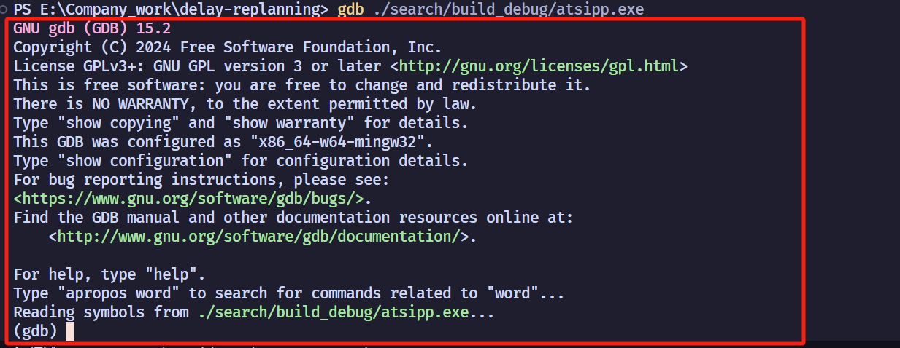
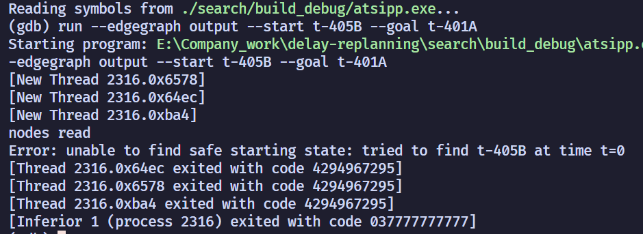
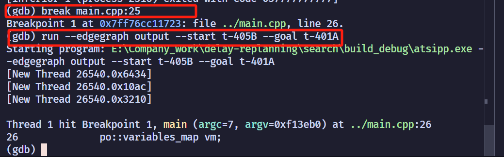
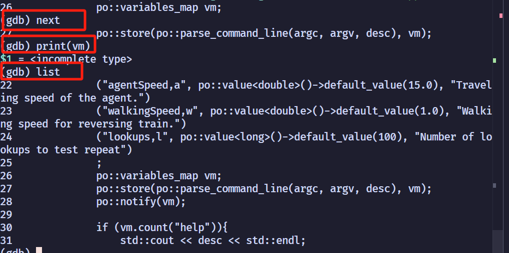
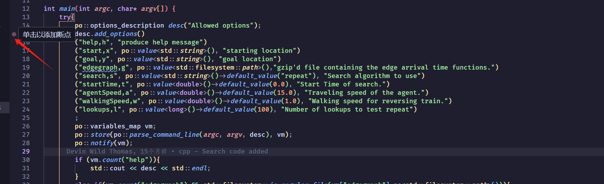
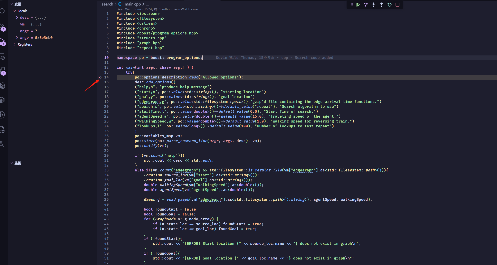
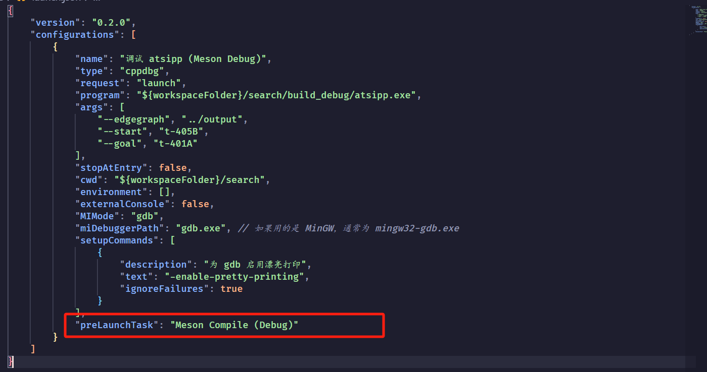
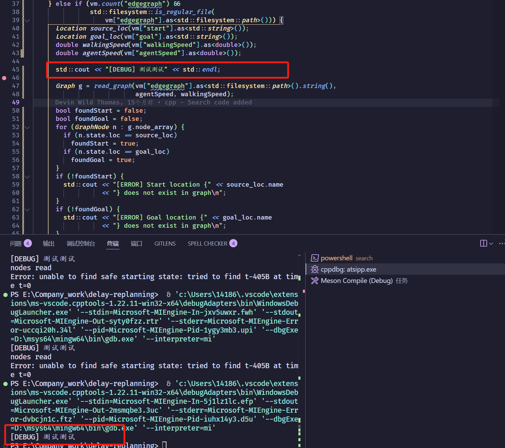

# vscode C++ 调试环境搭建

## 1. 开始（简单了解即可）

在项目中为们可以看到他有提供了一个debug版本的选项,如果我们要对其进行调试，就必须使用这个版本。

```shell
meson setup --buildtype debug build_debug
meson compile -C build_debug
```


生成debug 版本后就可以直接用GDB 进行调试了。

执行以下命令：

```shell
gdb ./search/build_debug/atsipp.exe
```



进行以下界面就说明了你已经进入了GDB调试环境了。

执行以下命令：

```shell
run --edgegraph ../output --start t-405B --goal t-401A
```



可以看到， 程序执行了， 提示没有找到列车。


现在我们可以给他添加断点：

```shell
break main.cpp:25
```

这个的意思是在main.cpp 文件下的第25行添加一个断点， 然后在执行运行命令



可以看到代码在这里被暂停了。



- `next`: 下一句
- `print(变量名)`： 打印变量
- `list`: 查看代码块

- ...

剩下的一些命令可以自行网络上了解，这就是使用原始GDB进行调试的方法。

使用这种方式可以看到，不直观也很不方便，所幸vscode 提供了更加便捷的调试方式（本质上用的还是GDB,只不过提供了更加便捷的方式）


## 2. 配置VScode

1.首先我们要做的就是在源代码中打断点， 打断点的方式如图所示：



2. 然后我们需要配置`launch.json` 文件， 在项目根目录创建`.vscode/launch.json` 文件.

```json
{
    "version": "0.2.0",
    // 重点是这部分
    "configurations": [
        // 这里每一个对象对应的就是vscode的一个调试任务
        {
            "name": "调试 atsipp (Meson Debug)",
            "type": "cppdbg",
            "request": "launch",
            // ${workspaceFolder} 表示工作区，以.vscode 上级文件夹为根目录下都是工作区
            // 这个关键字表示这就是我们要调试的程序
            "program": "${workspaceFolder}/search/build_debug/atsipp.exe",
            // 这个就是我们程序后面携带的参数
            "args": [
                "--edgegraph", "../output",
                "--start", "t-405B",
                "--goal", "t-401A"
            ],
            "stopAtEntry": false,
            // 这个要重点理解一下，他就是就是相当于我们这个命令执行的目录，就像我们前面的cd ../search
			// 然后执行命令，所对应的output 文件生成在根目录下所以就得上面的arg部分就得变成../output 
            "cwd": "${workspaceFolder}/search",
            
            // 剩下这些为默认配置，如果向详细了解可以去网上查看教程
            "environment": [],
            "externalConsole": false,
            "MIMode": "gdb",
            "miDebuggerPath": "gdb.exe", 
            "setupCommands": [
                {
                    "description": "为 gdb 启用漂亮打印",
                    "text": "-enable-pretty-printing",
                    "ignoreFailures": true
                }
            ]
        }
    ]
}
```

配置完成以上部分之后， 我们就可以在文件下直接进行调试了。在cpp文件下输入 **F5**



可以看到程序就在这里被停住了。

在这个上面我们可以看到六个标志


他们分别是：

- 执行到下一个断点
- 下一步
- 进入到方法
- 跳出方法
- 重新执行
- 退出

现在就可以开始调试了！😃😃😃😃

但是现在又有一个问题，如果我改动了文件， 我就得重新执行一遍最先开始的编译命令, 每次这样就很麻烦，有没有什么更加方便的方法能够快速的调试呢。

```
meson setup --buildtype debug build_debug
meson compile -C build_debug
```


## 3. 配置task任务

在`.vscode` 文件夹下面创建`task.json` 文件：

```json
{
    "version": "2.0.0",
    "tasks": [
        {
            "label": "Meson Setup (Debug)",
            "type": "shell",
            "command": "meson setup --buildtype debug build_debug",
             "options": {
                "cwd": "${workspaceFolder}/search"
            },
            "problemMatcher": [],
            "group": {
                "kind": "build",
                "isDefault": true
            }
        },
        {
            "label": "Meson Compile (Debug)",
            "type": "shell",
            "command": "meson compile -C build_debug",
            "problemMatcher": [],
            "dependsOn": ["Meson Setup (Debug)"],
             "options": {
                "cwd": "${workspaceFolder}/search"
            },
            "group": {
                "kind": "build",
                "isDefault": false
            }
        }
    ]
}
```

在`launch.json` 文件下新增字段：

```json
 "preLaunchTask": "Meson Compile (Debug)"    // 这个其实就是告诉执行调试前先执行编译任务， 这个名称对应的就是上面的task里面的label
```



然后就可以修改代码，然后**`F5`**, 就可以看到测试成功了。



🎉🎉🎉🎉🎉🎉🎉🎉